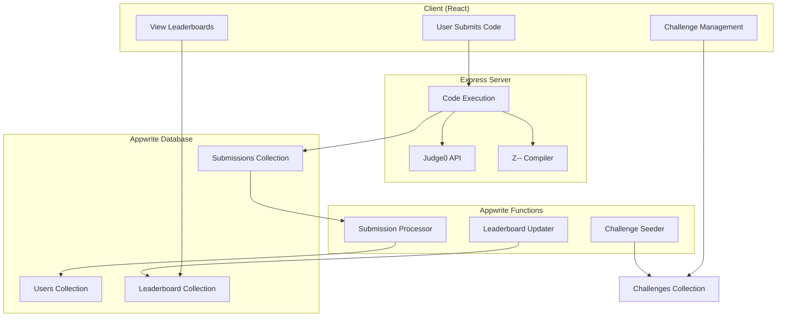

# Appwrite Functions Strategy for Z-Challenger

## 🎯 **Strategic Decision: Appwrite Functions vs Express Server**

### **Architecture Philosophy**

After analyzing your current codebase, here's the **optimal separation strategy**:

## 🚀 **KEEP in Express Server** (Performance-Critical)

### **Code Execution Engine** ⚡
```javascript
// Current: /server/src/
Express.js APIs (Port 3001)
├── /api/zlang/compile - Z-- Language compilation
├── /api/judge0/compile - Multi-language execution
└── /health-123 - Health check endpoint
```

**Why Keep in Express:**
- **Low Latency**: Sub-second response times critical for code execution
- **Real-time Processing**: Direct compilation and execution
- **External APIs**: Judge0 integration with rate limiting
- **Performance**: Persistent connections and caching
- **Scalability**: Can run multiple instances with load balancing

## 📊 **MOVE to Appwrite Functions** (Business Logic)

### **Database Operations & Background Tasks** 🔄

```javascript
// New: /appwrite-functions/
Serverless Functions
├── submission-processor/ - Process submission results
├── challenge-seeder/ - Seed challenges from JSON
├── leaderboard-updater/ - Update rankings (every 15min)
├── achievement-processor/ - Award achievements
└── analytics-aggregator/ - Generate statistics
```

**Why Move to Appwrite Functions:**
- **Event-Driven**: Automatically triggered by database changes
- **Database Access**: Direct access to Appwrite collections
- **Scalability**: Auto-scaling based on load
- **Cost Effective**: Pay per execution
- **Maintenance**: No server management required

---

## 🔄 **Migration Strategy**

### **Phase 1: Implement Core Functions** ✅
```bash
# Already implemented:
✅ challenge-seeder/src/main.js - Seeds challenges weekly
✅ submission-processor/src/main.js - Processes submissions on create
✅ leaderboard-updater/src/main.js - Updates rankings every 15min
```

### **Phase 2: Extract from Client** 
```typescript
// Move these from client/src/services/challengeService.ts:
updateUserStats() → submission-processor function
calculateRankings() → leaderboard-updater function
checkAchievements() → achievement-processor function
```

### **Phase 3: Add New Functions**
```javascript
// New functions to create:
├── achievement-processor/ - Extract achievement logic
├── analytics-aggregator/ - User behavior analytics
├── notification-sender/ - Achievement notifications
└── data-archiver/ - Archive old rankings/submissions
```

---

## 📋 **Implementation Details**

### **Current Express Server Responsibilities** ⚡
```javascript
// Keep these in /server/src/
1. Code Compilation & Execution
   - Z-- language compilation
   - Judge0 API integration
   - Real-time code testing
   - Performance metrics

2. External API Integration
   - Rate limiting for Judge0
   - Third-party service calls
   - WebSocket connections (future)
   - File processing
```

### **New Appwrite Functions Responsibilities** 📊
```javascript
// Move to /appwrite-functions/
1. Database Operations
   - User statistics updates
   - Challenge management
   - Ranking calculations
   - Achievement tracking

2. Background Processing
   - Scheduled leaderboard updates
   - Weekly challenge seeding
   - Data archiving
   - Analytics generation

3. Event-Driven Tasks
   - Submission processing
   - Achievement checks
   - Notification sending
   - User onboarding
```

---

## 🎯 **Data Flow Architecture**



---

## 🚀 **Benefits of This Architecture**

### **Performance** ⚡
- **Code Execution**: Remains fast with Express server
- **Background Tasks**: Don't block user interactions
- **Caching**: Leaderboard data cached every 15 minutes
- **Scalability**: Both systems can scale independently

### **Maintainability** 🔧
- **Separation of Concerns**: Clear boundaries between systems
- **Event-Driven**: Automatic processing without manual triggers
- **Error Isolation**: Functions failures don't affect code execution
- **Monitoring**: Built-in logging and error tracking

### **Cost Optimization** 💰
- **Express Server**: Only for active code execution
- **Functions**: Pay per execution for background tasks
- **Database**: Optimized queries with proper indexing
- **Caching**: Reduced database load with leaderboard cache

---

## 📊 **Migration Checklist**

### **Immediate Actions** (Week 1)
- [x] ✅ Configure appwrite.json with function definitions
- [x] ✅ Implement challenge-seeder function
- [x] ✅ Implement submission-processor function  
- [x] ✅ Implement leaderboard-updater function
- [ ] 🔄 Deploy functions to Appwrite console
- [ ] 🔄 Test functions with sample data

### **Client Updates** (Week 2)
- [ ] 📝 Remove user stats logic from challengeService.ts
- [ ] 📝 Update submission flow to rely on functions
- [ ] 📝 Implement real-time leaderboard from cache
- [ ] 📝 Add achievement notifications UI

### **Server Optimization** (Week 3)
- [ ] ⚡ Focus server on code execution only
- [ ] ⚡ Optimize Judge0 integration
- [ ] ⚡ Add WebSocket support for real-time features
- [ ] ⚡ Implement caching for frequently used data

### **Advanced Features** (Week 4)
- [ ] 🚀 Add achievement-processor function
- [ ] 🚀 Implement analytics-aggregator
- [ ] 🚀 Add notification-sender function
- [ ] 🚀 Create data archiving functions

---

## 🎯 **Final Recommendation**

**Perfect Architecture for Z-Challenger:**

1. **Express Server** = Real-time code execution engine
2. **Appwrite Functions** = Business logic and background processing
3. **Appwrite Database** = Single source of truth for all data
4. **Client** = Pure UI layer with minimal business logic

This gives you:
- ⚡ **Fast code execution** (Express)
- 📊 **Scalable data processing** (Functions)  
- 🎯 **Event-driven architecture** (Database triggers)
- 💰 **Cost-effective scaling** (Serverless functions)
- 🔧 **Easy maintenance** (Clear separation)

**Your current Express server is perfect for what it does - keep it focused on code execution. Move all database operations and background tasks to Appwrite Functions for optimal performance and maintainability.**
