```mermaid
erDiagram
    %% User Collection - Central Entity
    USERS {
        string $id PK
        string userId UK "Size: 50"
        int totalSubmissions "Default: 0"
        int successfulSubmissions "Default: 0"
        int totalPoints "Default: 0"
        array solvedChallenges "Size: 50"
        array preferredLanguages "Size: 20"
        int rank "Default: 0"
        string level "Default: beginner"
        datetime $createdAt
        datetime $updatedAt
        int globalRank "Default: 0"
        int weeklyRank "Default: 0"
        int monthlyRank "Default: 0"
        int weeklyPoints "Default: 0"
        int monthlyPoints "Default: 0"
        datetime lastActive
        int streak "Default: 0"
        int bestStreak "Default: 0"
        int avgSolveTime "Default: 0"
        string country "Default: India"
        string profilePicture "Size: 10000"
        boolean isPublic "Default: true"
        int starPoints "Default: 0"
        int currentStars "Default: 0"
        string starTitle "Default: Noob"
        int easyChallengesSolved "Default: 0"
        int mediumChallengesSolved "Default: 0"
        int hardChallengesSolved "Default: 0"
        array achievements "Size: 100000"
        array badgesEarned "Size: 10000"
        int nextStarRequirement "Default: 5"
    }

    %% Submissions Collection
    SUBMISSIONS {
        string $id PK
        string userId FK "Size: 50"
        string challengeId "Size: 50"
        string language "Size: 20"
        string code "Size: 50000"
        string status
        int score "Default: 0"
        int runtime "Default: 0"
        int memoryUsed "Default: 0"
        string testResults "Size: 10000"
        datetime submittedAt
        int starPointsEarned "Default: 0"
        string difficultyLevel "Size: 1000"
        int solveTime "Default: 0"
        int attempts "Default: 1"
        int hintsUsed "Default: 0"
        boolean isFirstSolve "Default: false"
        datetime $createdAt
        datetime $updatedAt
    }

    %% User Achievements Collection
    USER_ACHIEVEMENTS {
        string $id PK
        string userId FK "Size: 10000"
        string achievementId "Size: 1000"
        string achievementType "Size: 1000"
        string title "Size: 1000"
        string description "Size: 1000"
        datetime earnedAt
        string metadata "Size: 1000"
        datetime $createdAt
        datetime $updatedAt
    }

    %% Stars Collection - Reference Data
    STARS {
        string $id PK
        int starLevel UK "Min: 0, Max: 7"
        string title "Size: 1000"
        int pointsRequired
        string color "Size: 1000"
        string icon "Size: 1000"
        datetime $createdAt
        datetime $updatedAt
    }

    %% User Rankings Collection
    USER_RANKINGS {
        string $id PK
        string userId FK "Size: 10000"
        string rankingType "Size: 1000"
        int rank
        int points
        int starPoints
        int challengesSolved
        int currentStars
        string period "Size: 1000"
        datetime createdAt
        datetime $createdAt
        datetime $updatedAt
    }

    %% Leaderboard Collection - Cached Data
    LEADERBOARD {
        string $id PK
        string type "Size: 1000"
        string filter "Size: 1000"
        string data "Size: 10000"
        datetime lastUpdated
        datetime expiresAt
        datetime $createdAt
        datetime $updatedAt
    }

    %% Relationships
    USERS ||--o{ SUBMISSIONS : "userId"
    USERS ||--o{ USER_ACHIEVEMENTS : "userId" 
    USERS ||--o{ USER_RANKINGS : "userId"
    USERS }o--|| STARS : "currentStars references starLevel"
    USERS ||--o{ LEADERBOARD : "aggregated in data"

    %% Additional Notes
    USERS ||--|| USERS : "Self-referencing for rankings"
    SUBMISSIONS }|--|| CHALLENGES : "challengeId (external)"
```

## Database Flow Diagram - Detailed View

```mermaid
graph TB
    %% User Management Flow
    subgraph "User Management"
        U[Users Collection<br/>📊 Central Profile Data]
        U --> |userId| S[Submissions Collection<br/>💻 Code Submissions]
        U --> |userId| UA[User Achievements<br/>🏆 Achievement Tracking]
        U --> |userId| UR[User Rankings<br/>📈 Historical Rankings]
    end

    %% Reference Data
    subgraph "Reference Data"
        ST[Stars Collection<br/>⭐ Level Definitions]
        ST --> |starLevel| U
    end

    %% Cached/Computed Data
    subgraph "Performance Layer"
        LB[Leaderboard Collection<br/>🏅 Cached Rankings]
        U --> |aggregated| LB
    end

    %% External References
    subgraph "External Systems"
        CH[Challenges Collection<br/>🎯 Challenge Data]
        CH --> |challengeId| S
    end

    %% Data Flow Arrows
    S -.-> |updates stats| U
    S -.-> |triggers| UA
    U -.-> |periodic calc| UR
    U -.-> |cache refresh| LB

    %% Styling
    classDef primary fill:#8b5cf6,stroke:#7c3aed,stroke-width:3px,color:#fff
    classDef secondary fill:#06b6d4,stroke:#0891b2,stroke-width:2px,color:#fff
    classDef cache fill:#f59e0b,stroke:#d97706,stroke-width:2px,color:#fff
    classDef external fill:#6b7280,stroke:#4b5563,stroke-width:2px,color:#fff

    class U primary
    class S,UA,UR secondary
    class LB cache
    class ST,CH external
```



## Collection Relationships Matrix

```mermaid
graph LR
    subgraph "Core Collections"
        A[👤 Users<br/>Central Profile]
        B[📝 Submissions<br/>Code Records]
        C[🏆 Achievements<br/>User Badges]
        D[📊 Rankings<br/>Historical Data]
        E[⭐ Stars<br/>Level System]
        F[🏅 Leaderboard<br/>Cached Data]
    end

    %% Primary Relationships
    A -->|1:M| B
    A -->|1:M| C  
    A -->|1:M| D
    E -->|1:M| A
    A -->|aggregated| F

    %% Data Flow
    B -.->|updates| A
    A -.->|triggers| C
    A -.->|generates| D
    A -.->|refreshes| F

    %% Styling
    classDef users fill:#8b5cf6,stroke:#7c3aed,stroke-width:3px,color:#fff
    classDef data fill:#06b6d4,stroke:#0891b2,stroke-width:2px,color:#fff
    classDef system fill:#f59e0b,stroke:#d97706,stroke-width:2px,color:#fff

    class A users
    class B,C,D data
    class E,F system
```

